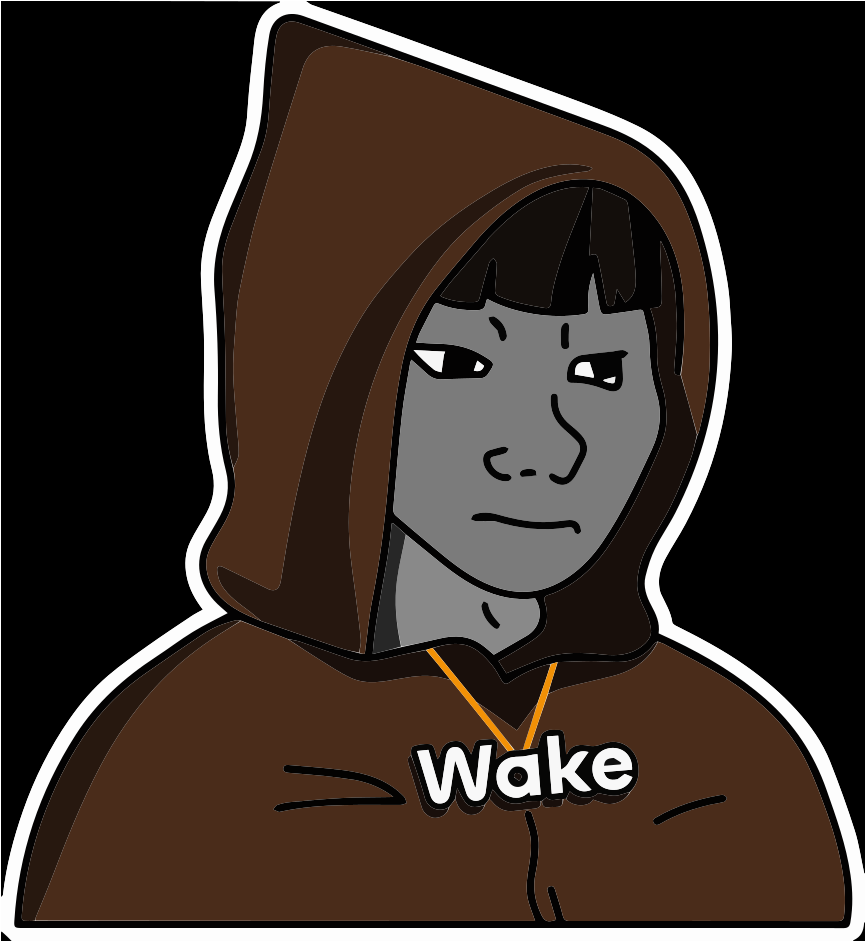
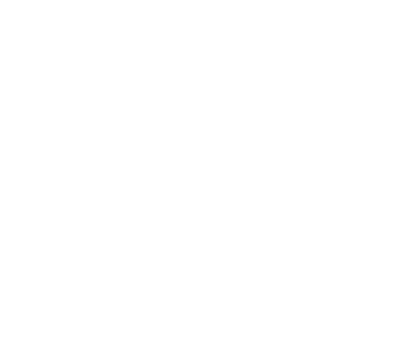
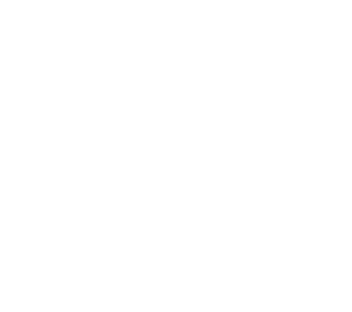

# Wakehacker Brand Assets

The official brand assets for any integrations, promotional or marketing materials.

## Company Logo

### wakehacker 
| Type - Color           | Download Location | 
| --------------- | --------------------------------- |
| PNG - With Background|  |
| PNG - Without Background |  |
| SVG - With Background |  |
| SVG - Without Background |  |

### Ackee Blockchain Security
| Type - Color           | Download Location | 
| --------------- | --------------------------------- |
| PNG - White|  |
| PNG - Black |  |
| SVG - White |  |
| SVG - Black |  |

## What Powers wakehacker

### Wake
| Type - Color           | Download Location | 
| --------------- | --------------------------------- |
| PNG - White |  |
| PNG - Black |  |
| SVG - White |  |
| SVG - Black |  |

## Colors

Wakehackers's main color is a vibrant blue color on a dark color scheme. 
| Color      | HEX                                                                                               | Notes              |
| ---------- | ------------------------------------------------------------------------------------------------- | ------------------ |
| Blue | `#0000FF`  | Primary color                   |
| Fuchsia  | `#FF00FF`  | Secondary color  |

## Typography

[Space Grotesk](https://floriankarsten.github.io/space-grotesk/) is our brand's typeface of choice.  Originally designed by Florian Karsten in 2018, Space Grotesk retains the monospace's idiosyncratic details while optimizing for improved readability at non-display sizes. Florian Karsten Studio (Brno, Czech Republic) is excited about open-source and peer2peer networks.

## Support

Questions? Send us an email hello@ackee.xyz
