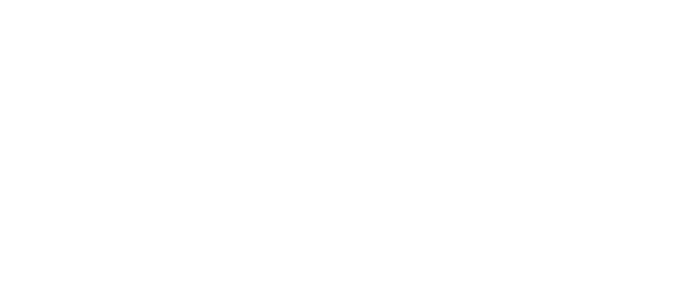

# Ackee Blockchain Security Brand Assets

The official brand assets for any integrations, promotional or marketing materials.

## Press & Photos
We are happy to support press features and interviews highlighting Ackee Blockchain Security and its leadership. You'll find a collection of high-resolution photos of our CEO, Josef Gattermayer, Ph.D., available for use in editorial content [here](https://github.com/Ackee-Blockchain/brand/blob/master/photo/photo.md).

## Guidelines
Please review our [Brand Guidelines](https://github.com/Ackee-Blockchain/brand/blob/master/Ackee%20Blockchain%20Security%20Brand%20Guidelines%20Version%202.0.pdf). 

Don't combine the Ackee Blockchain Security name, logos, or any portion of any of them, with any other logo, company name, mark, or generic terms outside of pre-approved partnerships and collaborations. Please don't edit, modify, distort, rotate, or recolor the logo. 

## Company Logo

### Ackee Blockchain Security
| Type - Color           | Download Location | 
| --------------- | --------------------------------- |
| PNG - White|  |
| PNG - Black |  |
| SVG - White |  |
| SVG - Black |  |

## Tooling Logos

### Wake
| Type - Color           | Download Location | 
| --------------- | --------------------------------- |
| PNG - White |  |
| PNG - Black |  |
| SVG - White |  |
| SVG - Black |  |

### Trident
| Type - Color           | Download Location | 
| --------------- | --------------------------------- |
| PNG - White |  |
| PNG - Black |  |
| SVG - White |  |
| SVG - Black |  |

### Solidity (Wake)
| Type - Color           | Download Location | 
| --------------- | --------------------------------- |
| PNG - Color |  |
| SVG - Color |  |

## Colors

Ackee Blockchain Security's main color is a vibrant blue color on a dark color scheme. 
| Color      | HEX                                                                                               | Notes              |
| ---------- | ------------------------------------------------------------------------------------------------- | ------------------ |
| Blue | `#0000FF`  | Primary color                   |
| Fuchsia  | `#FF00FF`  | Secondary color  |

## Typography

[Space Grotesk](https://floriankarsten.github.io/space-grotesk/) is our brand's typeface of choice.  Originally designed by Florian Karsten in 2018, Space Grotesk retains the monospace's idiosyncratic details while optimizing for improved readability at non-display sizes. Florian Karsten Studio (Brno, Czech Republic) is excited about open-source and peer2peer networks.

## Support

Questions? Send us an email hello@ackee.xyz
